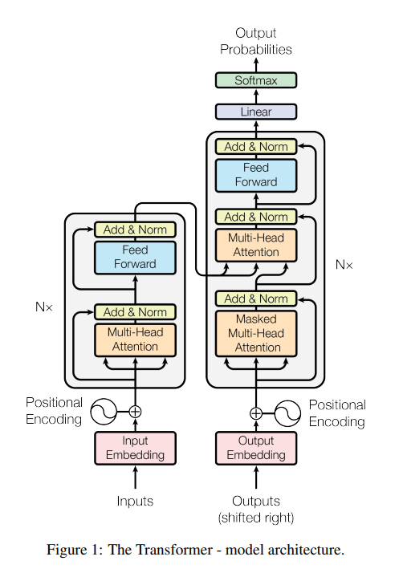
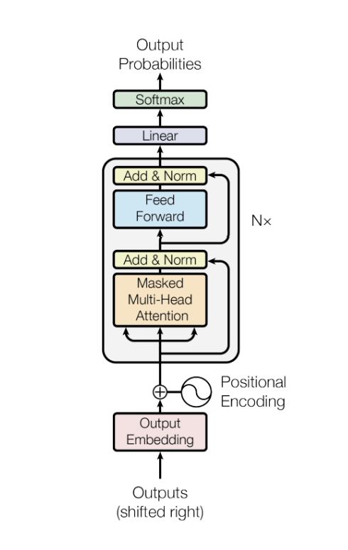
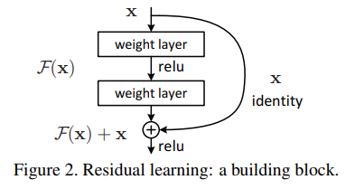
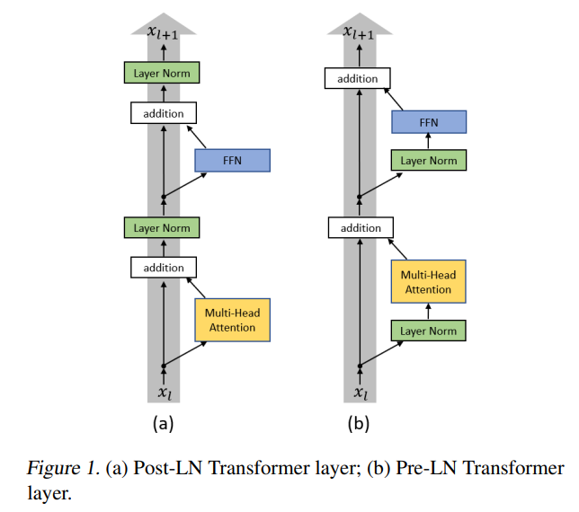
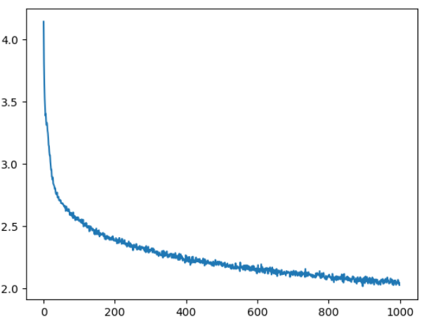

# GPT from Scratch

A PyTorch implementation of a Generatively Pretrained Transformer (GPT) built from the ground up, inspired by the "Attention is All You Need" paper and OpenAI's GPT-2/3 architecture.

## Overview

This project implements the complete pipeline for autoregressive language modeling, including:
- Model architecture implementation
- Training procedures
- Text generation/sampling
- Model evaluation

#### Self Attention (simple explanation)
```
Key = resume ("Here are my skills and qualities")
Query = job description ("I'm looking for someone with these skills")
dot(Query,Key) = how well the resume matches the job description
```

## Transformer Architecture

<p align="center">
  
</p>

## GPT architecture - Decorder only transformer
<p align="center">
  
</p>

## Implementation Progress

### Step 1: Bigram Language Model
**File:** `Bigram.py`

A simple bigram model serving as the foundation before adding transformer components.

**Training Results:**
```
Step    Loss
0       4.546
1000    3.676
2000    3.054
3000    2.730
4000    2.556
5000    2.520
6000    2.589
7000    2.403
8000    2.335
9000    2.460
```

**Sample Generation (100 tokens):**
```
Fours thid J ous?          
Bouelllllighapan ITh.      
I s.                       
LI:                        
The;                       
                           
Fary be be bu uneDortanethethe      
Foan tha                            
nchee                               
```
*Note: Output quality is limited due to the simple bigram approach*

### Step 2: Single Self-Attention Head
**File:** `single_attention.py`

Added a single self-attention mechanism to improve context understanding.

**Training Results:**
```
Step    Loss
0       4.210
1000    2.466
2000    2.476
3000    2.479
4000    2.425
5000    2.337
6000    2.290
7000    2.260
8000    2.311
9000    2.239
```

**Sample Generation (100 tokens):**
```
HAMTER:                                 
K maz: 
Bot I'lte se we my, 'd die cenotirh,
I'n:
Met,
Shave malke sherd.
Pa'd Golle ave ye X
```
*Improved coherence with attention mechanism*


### Step 3: Multi-Head Attention Mechanism
**File:** `multi_head_attn.py`

Adding a Multi-Head Attention Mechanism to improve context understanding further.

**Training Results:**
```
0/10000  4.186285018920898
1000/10000  2.49324107170105
2000/10000  2.2129158973693848
3000/10000  2.2964208126068115
4000/10000  2.1379356384277344
5000/10000  1.9161547422409058
6000/10000  2.146939277648926
7000/10000  2.1689884662628174
8000/10000  2.5390045642852783
9000/10000  2.099254608154297
```

**Sample Generation (100 tokens):**
```
As youblead, my dimy obelcersing,
Hall in thous ti wing meged Cad ticeds yould with I thath dy me my
```

*Improved with multi head attention mechanism*


### Step 4: Multi-Head Attention -> MLP
**File:** `multi_head_attn.py`

Added a MLP right after Multi-Head Attention to model to thinking from context understanding.

**Training Results:**
```
0/10000  4.207912445068359
1000/10000  2.381828546524048
2000/10000  2.2483139038085938
3000/10000  2.309636116027832
4000/10000  2.297687292098999
5000/10000  2.17193865776062
6000/10000  1.8909931182861328
7000/10000  1.9600961208343506
8000/10000  2.1503922939300537
9000/10000  1.7582848072052002
10000/10000  2.167241334915161
```

**Sample Generation (100 tokens):**
```
Go thou nike,
Seciting festan's teeess wardsteks asemp, hry is gid, ther.

From be,
Mly's'd why shri
```

*Improved with mlp + multi head attention*


### Step 5: Block
**File:** `gpt.py`

Added 3 Blocks (Multi head Attn + MLP).

**Training Results:**
```
0/10000  4.158382415771484
1000/10000  2.9269192218780518
2000/10000  2.3666820526123047
3000/10000  2.620711326599121
4000/10000  2.367741584777832
5000/10000  2.126526355743408
6000/10000  2.201690912246704
7000/10000  2.2551534175872803
8000/10000  2.4167087078094482
9000/10000  2.2175307273864746
10000/10000  2.0515248775482178
```

**Sample Generation (100 tokens):**
```
Ford's low, dow's sts-biiterd hult brrivests your I swerest yom sa bestour
Bet'll mubterefe is gests
```

*Improved by wrapping (multi head attention + mlp) with block*

## Residual Connection


<p align="center">
  
</p>
residual networks are easier to optimize, and can gain accuracy from
considerably increased depth


### Step 6: Residual Connections
**File:** `gpt.py`

Added residual connections.

**Training Results:**
```
0/10000  4.778691291809082
1000/10000  2.2697150707244873
2000/10000  2.152113914489746
3000/10000  2.1752171516418457
4000/10000  2.4939568042755127
5000/10000  2.146027088165283
6000/10000  2.1327855587005615
7000/10000  2.1346640586853027
8000/10000  2.0998589992523193
9000/10000  2.0526294708251953
10000/10000  1.9960142374038696
```

**Sample Generation (100 tokens):**
```
Conys,
ThLoue dels hall secan,
And your dous, a hus a deperes wilives O'er prange
He are her sheagh
```

*DNN suffer from optimisation problems by residual conn gradients flow DNN vanishing/exploding*


### Step 7: Deep MLP
**File:** `gpt.py`

Increased size of MLP in Block.

**Training Results:**
```
0/10000  4.628260135650635
1000/10000  2.6013002395629883
2000/10000  2.1020402908325195
3000/10000  2.4611384868621826
4000/10000  2.0678110122680664
5000/10000  2.3793909549713135
6000/10000  1.8049612045288086
7000/10000  1.5897706747055054
8000/10000  2.058210849761963
9000/10000  2.1545569896698
10000/10000  1.823158860206604
```

**Sample Generation (100 tokens):**
```
HAM:
O't ject the goods!
For our here is bestring of otill-son!
You to borritue
there.

MICI serves
```

*More space to learning and thinking*


## Post-LN vs Pre-LN

<p align="center">
  
</p>


### Step 8: Post-Layer Normalization (original-designed)
**File:** `gpt.py`

Added LayerNorms after both Multi head and MLP.

**Training Results:**
```
0/10000  4.419777870178223
1000/10000  2.17536997795105
2000/10000  2.062408685684204
3000/10000  2.344139337539673
4000/10000  1.889953851699829
5000/10000  2.36834979057312
6000/10000  2.168095111846924
7000/10000  1.7695579528808594
8000/10000  2.1250112056732178
9000/10000  2.0149948596954346
10000/10000  2.1397757530212402
```

**Sample Generation (100 tokens):**
```
Or conwlarga.

LAY I blood tcrain. Belioustil all of that wors, contial of the sance,
I we Vather, i
```

*accelerating and stabilizing training*


### Step 9: Pre-Layer Normalization
**File:** `gpt.py`

Added LayerNorms before both Multi head and MLP.

**Training Results:**
```
0/10000  4.2975754737854
1000/10000  2.2530312538146973
2000/10000  2.0723907947540283
3000/10000  2.1760218143463135
4000/10000  1.9147815704345703
5000/10000  2.18458890914917
6000/10000  2.5072474479675293
7000/10000  1.9511529207229614
8000/10000  2.0356907844543457
9000/10000  1.8102020025253296
10000/10000  1.9324538707733154
```

**Sample Generation (100 tokens):**
```
CHARD Thoses; and a Poly voge!

First strowned
And that,
That,
What worrich own a geness,
From, my 
```

*accelerating and stabilizing training*


### Step 10: Dropouts
**File:** `gpt.py`

Added Dropouts end of the each of sub layers.

**Training Results:**
```
0/10000  4.3352370262146
1000/10000  2.6242640018463135
2000/10000  2.322222948074341
3000/10000  2.5242919921875
4000/10000  2.3064157962799072
5000/10000  2.2172739505767822
6000/10000  2.1584432125091553
7000/10000  2.423521041870117
8000/10000  2.1975138187408447
9000/10000  2.3287415504455566
10000/10000  2.5118088722229004
```

**Sample Generation (100 tokens):**
```
Wo-eve  qoy.
 Exgue their ling thempelank.

KINY VAETER:
Ho it spein's werepdeen that of agood, But 
```

*effective technique for regularization and preventing the co-adaptation of neurons*


### Step 11: Deep NN
**File:** `gpt.py`

Incresed #hyperparameters.

**Training Results:**
```
0/10000  4.264957427978516
1000/10000  2.3860034942626953
2000/10000  2.094944953918457
3000/10000  2.1648499965667725
4000/10000  2.200188636779785
5000/10000  2.195688009262085
6000/10000  2.0683956146240234
7000/10000  1.9538644552230835
8000/10000  1.9664744138717651
9000/10000  1.9402655363082886
10000/10000  1.988709568977356
```

**Sample Generation (100 tokens):**
```
Hop sk be all ba't,
Hon you but: loeevedy:
Sworb.

LEENBECHIO:
Why the chinhe, good His jay do fulg  
```

*deep neural network ~300K params*


### Step 12: GPU
**File:** `gpt.py`

Model trained on T4 GPU.

**Training Results:**
```
0/10000  4.360275745391846
1000/10000  2.4701366424560547
2000/10000  2.394174814224243
3000/10000  2.253653049468994
4000/10000  2.2769970893859863
5000/10000  2.2080271244049072
6000/10000  2.155518054962158
7000/10000  2.076859951019287
8000/10000  2.0508880615234375
9000/10000  2.046293258666992
10000/10000  2.072751760482788
```

**Sample Generation (100 tokens):**
```
Far you.

DUCKE?
SIO:
Shat so bolich he is sort com of it a lam haplame
Lard ray:
A Gode callerZy a'  
```

*1208385 ~(1.2M) param model traied ~6mins*


## Loss Curve - step 12

<p align="center">
  
</p>


## References

- [Attention Is All You Need](https://arxiv.org/abs/1706.03762) - The original Transformer paper
- [Deep Residual Learning for Image Recognition](https://arxiv.org/abs/1512.03385)
- [Layer Normalization](https://arxiv.org/abs/1607.06450)
- [On Layer Normalization in the Transformer Architecture](https://arxiv.org/abs/2002.04745)
- [Improving neural networks by preventingco-adaptation of feature detectors](https://arxiv.org/abs/1207.0580)
- OpenAI GPT-2/3 architectures

